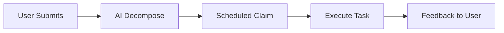
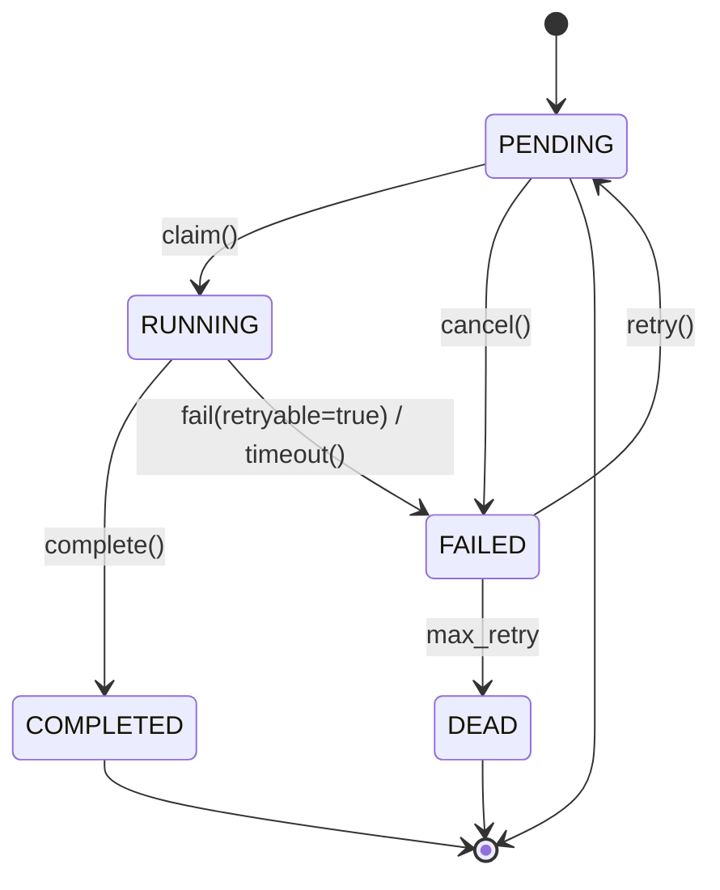

# OpenClaw Task Queue

SQLite-based task queue with atomic operations for AI agents.

## Core Value

AI-driven task queue automation: user submits task → AI decomposes → scheduled claim → execution → feedback loop.

## Features

- **AI-Driven Automation** - Scheduled automatic task execution without manual intervention
- **SQLite + WAL Mode** - Single file database with high concurrency support
- **Atomic Task Claim** - CAS prevents duplicate processing
- **Auto Timeout Recovery** - Stuck tasks automatically recycled
- **Retry Mechanism** - Failed tasks auto-retry with configurable limits
- **Priority Queue** - Process by priority and creation time
- **Scheduled Tasks** - Support delayed execution
- **Task Tracking** - Complete status and history
- **Built-in Cron** - Automatic periodic task queue processing

## Installation

### As OpenClaw Plugin

```bash
openclaw plugins install @openclaw-task-queue/core
```

### As Standalone Library

```bash
npm install @openclaw-task-queue/core better-sqlite3
```

## Workflow



## Quick Start

### OpenClaw Plugin Usage

After installation, the following tools are automatically available:

```
User: Analyze this large dataset

Agent: [Uses task_create]
✅ Created task task-xxx
```

### Demo

#### 1. Create Task

```
User: Create a simple test task

Agent: [Calls task_create]
✅ Created simple test task

| Field | Value |
|-------|-------|
| Task ID | task-xxx |
| Type | test |
| Priority | low |
| Status | ⏳ PENDING |
```

#### 2. Get Stats

```
User: Get task statistics

Agent: [Calls task_stats]
Task statistics:

| Status | Count |
|--------|-------|
| ⏳ PENDING | 3 |
| 🔄 RUNNING | 0 |
| ✅ COMPLETED | 0 |
| ❌ FAILED | 0 |
```

#### 3. List Tasks

```
User: List all pending tasks

Agent: [Calls task_list]
Pending tasks:

| # | Task ID | Type | Priority |
|---|---------|------|----------|
| 1 | task-xxx | test | 5 |
| 2 | task-yyy | analysis | 10 |
```

#### 4. Check Status

```
User: Check status of task xxx

Agent: [Calls task_status]
Task status:

| Field | Value |
|-------|-------|
| Task ID | task-xxx |
| Status | ⏳ PENDING |
| Priority | 5 |
| Created | 2026-03-13 12:00:00 |
```

#### 5. Cancel Task

```
User: Cancel task task-xxx

Agent: [Calls task_cancel]
✅ Task cancelled successfully
```

### Standalone Usage

```typescript
import { TaskQueue, TaskWorker } from "@openclaw-task-queue/core";

const queue = new TaskQueue({
  dbPath: "./tasks.db",
  maxRetries: 3,
  timeoutSeconds: 300,
});

const taskId = await queue.createTask({
  type: "data-analysis",
  payload: { dataset: "sales_2024.csv" },
  priority: "high",
});

console.log(`Created task: ${taskId}`);
```

## Tools

### task_create

Create a new background task.

```json
{
  "type": "report-generation",
  "payload": {
    "template": "monthly",
    "month": "2024-03"
  },
  "priority": "high"
}
```

Parameters:
- `type` (required): Task type identifier
- `payload` (required): Task data
- `priority`: "high" | "medium" | "low" (default: "medium")
- `scheduledAt`: ISO datetime for delayed execution

### task_status

Check task status.

```json
{
  "taskId": "task-1710123456-abc123"
}
```

### task_list

List tasks with filters.

```json
{
  "status": "PENDING",
  "type": "data-analysis",
  "limit": 50
}
```

### task_cancel

Cancel a pending task.

```json
{
  "taskId": "task-1710123456-abc123"
}
```

### task_stats

Get queue statistics.

```json
{}
```

Returns:
```json
{
  "PENDING": 15,
  "RUNNING": 2,
  "COMPLETED": 234,
  "FAILED": 3,
  "DEAD": 1
}
```

### task_decompose

Decompose a complex task into atomic subtasks with dependencies.

```json
{
  "subtasks": [
    {
      "id": "step-1",
      "type": "analyze",
      "payload": { "target": "dataset" },
      "orderIndex": 0
    },
    {
      "id": "step-2",
      "type": "process",
      "payload": { "input": "step-1-result" },
      "dependsOn": ["step-1"],
      "blocking": "interactive",
      "orderIndex": 1
    },
    {
      "id": "step-3",
      "type": "report",
      "payload": { "data": "step-2-result" },
      "dependsOn": ["step-2"],
      "blocking": "background",
      "orderIndex": 2
    }
  ]
}
```

Parameters:
- `subtasks` (required): Array of subtask definitions
  - `id`: Temporary ID for referencing (e.g., "step-1")
  - `type`: Task type identifier
  - `payload`: Task data
  - `blocking`: "background" (default) | "interactive"
  - `dependsOn`: Array of subtask IDs this depends on
  - `orderIndex`: Execution order (lower = earlier)
- `askUser`: Set to true if cannot decompose - will prompt user

Returns:
```json
{
  "success": true,
  "createdSubtasks": 3,
  "tasks": [
    { "tempId": "step-1", "taskId": "task-xxx", "blocking": false },
    { "tempId": "step-2", "taskId": "task-yyy", "blocking": true },
    { "tempId": "step-3", "taskId": "task-zzz", "blocking": false }
  ],
  "paused": true,
  "message": "Created 3 subtasks. Workflow paused at interactive subtask(s).",
  "nextAction": "Wait for user confirmation before continuing."
}
```

### task_archive

Archive a completed task.

```json
{
  "taskId": "task-1710123456-abc123"
}
```

### task_cleanup

Clean up old archived tasks.

```json
{
  "olderThanDays": 7
}
```

Parameters:
- `olderThanDays`: Remove archived tasks older than this many days (default: 7)

### task_purge

Permanently delete specific tasks by ID.

```json
{
  "taskIds": ["task-1710123456-abc123", "task-1710123457-def456"]
}
```

Parameters:
- `taskIds` (required): Array of task IDs to delete

### task_find_stuck

Find stuck tasks that need cleanup (PENDING with error messages).

```json
{}
```

Returns tasks with errors like "Cancelled by user" or timeout.

### task_repair

Repair historical cancelled tasks. Fixes tasks that were cancelled before the bug fix - changes PENDING tasks with "Cancelled" error to FAILED status.

```json
{}
```

Returns number of repaired tasks.

## Task Lifecycle



## Configuration

### OpenClaw Plugin

```json
{
  "plugins": {
    "entries": {
      "task-queue": {
        "enabled": true,
        "config": {
          "dbPath": "~/.openclaw/task-queue.db",
          "concurrency": 1,
          "pollIntervalMs": 5000,
          "maxRetries": 3,
          "timeoutSeconds": 300,
          "enableWorker": true,
          "cronEnabled": true,
          "cronIntervalMs": 60000
        }
      }
    }
  }
}
```

### Configuration Options

| Option | Type | Default | Description |
|--------|------|---------|-------------|
| dbPath | string | ~/.openclaw/task-queue.db | Database path |
| concurrency | number | 1 | Max concurrent tasks |
| pollIntervalMs | number | 5000 | Worker poll interval |
| maxRetries | number | 3 | Max retry attempts |
| timeoutSeconds | number | 300 | Task timeout |
| enableWorker | boolean | true | Enable worker |
| cronEnabled | boolean | true | Enable built-in cron |
| cronIntervalMs | number | 60000 | Cron interval |

## Long-Running Agent

### Core Concept

Build autonomous AI Agent using task queue + built-in Cron:

1. **Task Entry**: User submits task via conversation
2. **Task Decomposition**: AI splits into executable subtasks
3. **Scheduled Claim**: Cron automatically checks and claims tasks
4. **Execution Feedback**: Update status and notify user after execution

### Example

```javascript
// User submits: "Refactor this project"

// 1. AI creates main task
await taskCreate({
  type: "code-refactor",
  payload: { target: "entire project" }
});

// 2. AI decomposes into subtasks
await taskCreate({ type: "analyze", payload: {...} });
await taskCreate({ type: "refactor-module-a", payload: {...} });
await taskCreate({ type: "refactor-module-b", payload: {...} });
await taskCreate({ type: "test", payload: {...} });

// 3. Built-in Cron auto-claims and executes
// cronIntervalMs = 60000 (check every minute)
```

## Architecture

### Why SQLite?

- **No External Dependencies** - No Redis, PostgreSQL, etc.
- **Single File** - Easy backup, migration, debugging
- **WAL Mode** - Better concurrent read/write performance
- **Atomic Operations** - CAS prevents race conditions

### Atomic Task Claiming

```sql
UPDATE tasks
SET status = 'RUNNING',
    claimed_at = CURRENT_TIMESTAMP,
    claimed_by = :worker_id
WHERE id = (
    SELECT id FROM tasks
    WHERE status = 'PENDING'
    ORDER BY priority DESC, created_at ASC
    LIMIT 1
)
AND status = 'PENDING'  -- CAS check!
RETURNING *;
```

This statement atomically:
1. Finds highest priority pending task
2. Only claims if still PENDING (prevents race)
3. Returns the claimed task

### Database Schema

```sql
CREATE TABLE tasks (
  id TEXT PRIMARY KEY,
  type TEXT NOT NULL,
  payload TEXT NOT NULL,
  priority INTEGER DEFAULT 0,
  
  status TEXT DEFAULT 'PENDING',
  retry_count INTEGER DEFAULT 0,
  max_retries INTEGER DEFAULT 3,
  
  claimed_at DATETIME,
  claimed_by TEXT,
  timeout_seconds INTEGER DEFAULT 300,
  
  created_at DATETIME DEFAULT CURRENT_TIMESTAMP,
  started_at DATETIME,
  completed_at DATETIME,
  scheduled_at DATETIME,
  
  result TEXT,
  error TEXT,
  
  -- Task decomposition fields
  depends_on TEXT,        -- JSON array: ["task-1", "task-2"]
  order_index INTEGER,    -- execution order
  archived_at DATETIME,   -- archival timestamp
  
  source_channel TEXT,
  source_conversation TEXT,
  source_message TEXT
);
```

## Comparison

| Feature | This Project | File-based | Redis (BullMQ) |
|---------|-------------|------------|----------------|
| Concurrency safe | ✅ | ❌ | ✅ |
| No external deps | ✅ | ✅ | ❌ |
| Easy backup | ✅ | ✅ | ❌ |
| Atomic ops | ✅ | ❌ | ✅ |
| Query tasks | ✅ | ❌ | ⚠️ |
| OpenClaw native | ✅ | ⚠️ | ❌ |
| Built-in Cron | ✅ | ❌ | ❌ |

## Development

```bash
npm install
npm run build
npm test
npm run test:watch
```

## License

MIT
